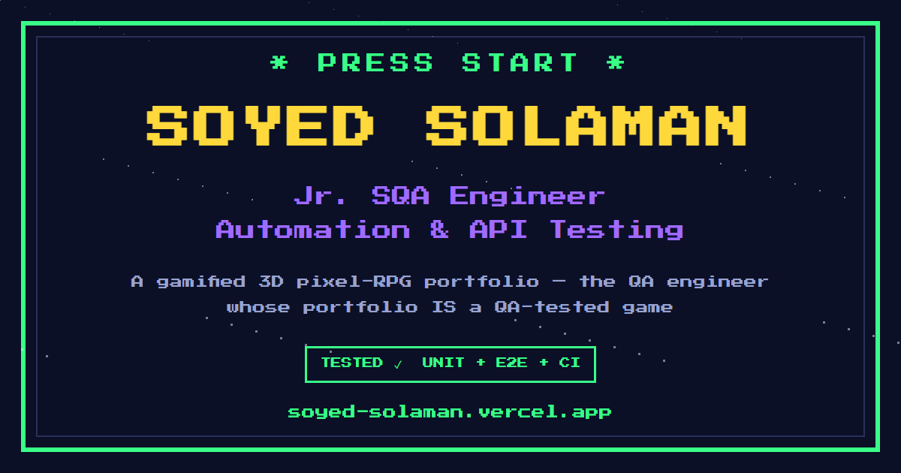

# ⛏️ Minecraft-Inspired Personal Portfolio

A gamified 3D pixel-RPG portfolio, built as a playable voxel world.

**🎮 Live demo: https://soyed-solaman.vercel.app**




## About

Instead of a scrolling résumé, this portfolio is a small game: you play as a
voxel hero walking a winding loop road around a living blocky mini city —
towers, rivers, a beach, a stadium, a circling train, floating islands, and
Bangladeshi landmarks on the horizon. Scrolling walks the hero; glowing
crystals along the road open each portfolio section.

- **Round 1 — The Portfolio:** journey, skills, projects, roadmap, resume, contact.
- **Round 2 — The Playground:** interview question dungeon, AI-generated quizzes, a live job board, a company codex.
- **The end:** the hero walks off a cliff and respawns — the road is a circle. 🔁

Along the way: XP, ranks, coins, achievements, a synthesized chiptune
soundtrack (Web Audio, zero audio files), day/night themes, touch + gyro
controls on mobile, and a full 2D fallback for reduced-motion or no-WebGL
visitors.

## Tech stack

| Layer | Choice |
| --- | --- |
| UI | React 18 + Vite |
| 3D | Three.js via @react-three/fiber + @react-three/drei |
| Animation | Framer Motion (UI) · `useFrame` loops (world) |
| Styling | Tailwind CSS + CSS-variable pixel palette |
| State | zustand, persisted to localStorage |
| Audio | Web Audio API — all sounds synthesized in code |
| Backend | Vercel serverless functions (`/api`) — Gemini quiz generator, JSearch job feed |
| Forms | Web3Forms + Calendly |
| Quality | Vitest (55 unit tests) · ESLint · GitHub Actions CI · [manual test cases, API tests & k6 load tests](qa/) |

## Quick start

```bash
git clone https://github.com/SoyedFajol/minecraft-portfolio.git
cd minecraft-portfolio
npm install
npm run dev      # → http://localhost:5173
```

```bash
npm test         # vitest unit suite
npm run lint     # eslint
npm run build    # production build
```

The site runs fully without any API keys — AI features fall back to built-in
question banks, so nothing breaks in a fresh clone.

## Environment variables (optional, server-side only)

| Var | Enables | Where to get it |
| --- | --- | --- |
| `GEMINI_API_KEY` | AI quiz generation (`/api/generate-quiz`) | Google AI Studio (free tier) |
| `RAPIDAPI_KEY` | Live job board (`/api/jobs`) | RapidAPI → JSearch (free tier) |

Copy `.env.example` to `.env` for local dev. In production, set them in
Vercel → Project → Settings → Environment Variables. Keys never appear in
frontend code.

## Project structure

```
lib/            shared modules — profile data (single source of truth),
                job normalization, quiz validation; used by BOTH src/ and api/
api/            Vercel serverless functions (generate-quiz, jobs)
src/
  components/   pixel UI (HUD, overlays, sections, intro screen)
  scene/        the 3D world — hero, terrain, city, NPCs, checkpoints
  game/         progression: XP curve, ranks, rewards, synthesized sfx
  store/        zustand stores (game save + UI state)
  data/         frontend re-exports of lib/profile
  styles/       Tailwind + palette CSS variables
tests/          vitest unit suite
qa/             manual test cases, release checklist, API tests, k6 load test
```

## Inspired? Setup tips for building your own

1. **Start from the scroll.** Map `window.scrollY` → a `t` value from 0 to 1,
   and place everything on a path as a function of `t`. Walking, camera, and
   checkpoints all fall out of that one number.
2. **Instance everything that repeats.** Terrain blocks, trees, coins, and
   pillars are `InstancedMesh` — the whole world stays within a mobile
   frame budget. One material + one geometry per repeated thing.
3. **Budget for phones first.** Branch every count on a `mobile` flag
   (fewer blocks, lower DPR, no antialiasing) and test at 360 px width.
   Most visitors will be on a phone.
4. **Synthesize your audio.** The Web Audio API can make footsteps, coins,
   and a full chiptune loop in ~200 lines — no assets, no licensing.
5. **Keep an escape hatch.** Reduced-motion and no-WebGL visitors get a flat
   2D version. Accessibility is a feature, not an afterthought.
6. **Let AI fail safely.** Every AI call validates its response, retries
   once, then falls back to hardcoded content. The site must never break
   because an API did.
7. **Test the boring parts.** Progression math, save/load, and data
   validation are plain functions — unit-test those, and the game logic
   stays trustworthy while you play with the visuals.

## Guardrails

- No API keys in frontend code.
- No personal contact data beyond email — enforced by tests.
- Jobs come from legitimate aggregator APIs, no scraping.

---

Built & QA-tested by **Soyed Md. Solaman Fajul (Soyed Solaman)** — Software
Engineer · SQA @ BRAC IT Services Ltd., Dhaka.
[GitHub](https://github.com/SoyedFajol) ·
[LinkedIn](https://www.linkedin.com/in/soyed-md-solaman-fajul-a492b6214/)
